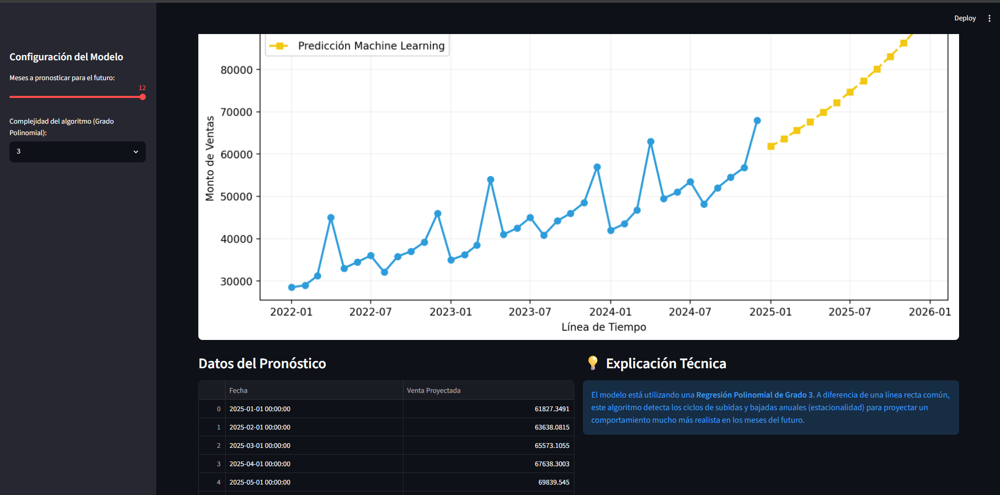

# Dashboard de Análisis y Predicción de Ventas con Machine Learning

Este proyecto es una aplicación web interactiva desarrollada completamente en **Python** que utiliza modelos de Inteligencia Artificial para pronosticar la demanda de ventas futuras basándose en datos históricos.

## Tecnologías Utilizadas
* **Python 3.12**
* **Streamlit**: Para el diseño y despliegue de la interfaz web interactiva.
* **Scikit-Learn**: Implementación del modelo de Machine Learning (Regresión Polinomial).
* **Pandas**: Manipulación, limpieza y análisis de estructuras de datos.
* **Matplotlib**: Generación de gráficos y visualizaciones estacionales.

## ⚙️ Características de la Aplicación
* **Análisis del Pasado**: Cálculo dinámico de KPIs clave (Venta total, promedio mensual y meses analizados).
* **Predicción del Futuro**: El usuario puede interactuar con una barra lateral para definir cuántos meses al futuro desea predecir.
* **Flexibilidad del Algoritmo**: Permite ajustar en tiempo real el grado polinomial del modelo para evaluar diferentes escenarios de ajuste y sobreajuste (Overfitting/Underfitting).

---

## Vista General de la Aplicación

### Explicación de la Interfaz y del Modelo

El producto analítico se divide en tres componentes estratégicos que combinan la ingeniería de datos, la analítica predictiva y las reglas de negocio:

#### 1. Panel de Control Interactivo (Barra Lateral)
* **Control de Simulación**: En el margen izquierdo se ubica el panel de configuración. Cuenta con un control deslizante (*slider*) que permite definir dinámicamente el horizonte de predicción (de 1 a 12 meses) y un menú desplegable para cambiar el grado de la Regresión Polinomial (Grado 2, 3 o 4) en tiempo real.
* **Impacto**: Transforma un script estático en una herramienta auto-gestionable para los usuarios de negocio, permitiéndoles simular escenarios de demanda bajo demanda sin necesidad de escribir código.

#### 2. Pronóstico con Ajuste Estacional (Gráfico Central)
* **Interpretación Visual**: La línea azul representa el histórico real de ventas mensuales recopilado durante 36 meses (2022-2024). La línea amarilla discontinua muestra la proyección calculada por el algoritmo de Machine Learning para el año 2025.
* **Lógica del Modelo**: Al utilizar una **Regresión Polinomial**, el modelo supera las limitaciones de una regresión lineal simple (que solo traza rectas) y logra modelar curvas complejas. Captura con éxito la **estacionalidad** del negocio (como los picos recurrentes detectados alrededor de abril de cada año), generando un pronóstico adaptado al comportamiento real del mercado.

#### 3. Métricas Financieras y Sustento Técnico (Bloque Superior e Inferior)
* **Procesamiento de Datos**: A través de la librería Pandas, la app calcula dinámicamente en la cabecera los KPIs del negocio: la Venta Total Histórica (`S/. 1,584,800.00`), el Promedio Mensual (`S/. 44,022.22`) y la consistencia de los datos analizados (`36 meses`).
* **Transparencia Técnica**: En la sección inferior se expone la tabla con los valores numéricos exactos resultantes de la predicción junto a una caja informativa que detalla la configuración del algoritmo, mitigando el efecto de "caja negra" habitual en la Inteligencia Artificial.
